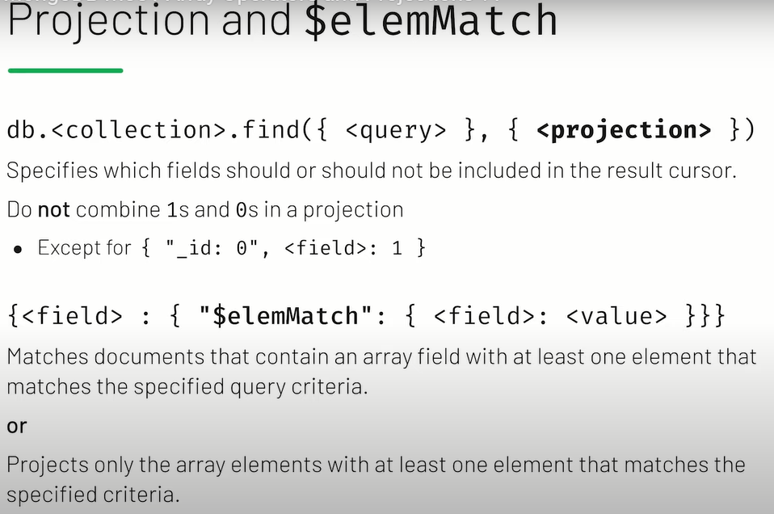

# Query Operators - Comparison

- `$eq` ==> `Equal to`
- `$nq` ==> `Not Equal to`
- `$gt` ==> `Greater Than`
- `$gte` ==> `Greater Tan or Equal to`
- `$lt` ==> `Less Than`
- `$lte` ==> `Less Than or Equal to`

- to use:
  - `{<field>:{<Operator>:<value>}}`

---

## Query Operators - Logic

- `$and` ==> `Match all the specified query clauses`
- `$ro` ==> `At least one of the query clauses is matched`
- `$nor` ==> `fail to match both given clauses`
- `$not` ==> `Negate s the query requirements`
- to use `$and`, `$ro` and `$nor` :
  - `{<Operator>:[{statement1}, {statement2}, ......]}`
  - to use `$not` :
    - `{$not:{statement1}`

---

## Expressive Query Operator

- `{"$expr" :{<expression>}}`

  - `{ "$expr": { "$eq": [ "$twitter_username", "$permalink"] } }`

---

## Array Operators

- `{ "<array field>": { "$size": <number>}}` ==> return the array field that have the same size of the given number
- `{ "<array field>": { "$all":[value1, value2 ........]}}`==> return the array field that have the same array of the given array
- `{ "<array field>": { "$all":[value1]}}`==> return the array field that have the only same value of the given array

---

## Array Operators and Projection

- 
- `db.grades.find({ "class_id": 431 },{ "scores":{"$elemMatch": { "score": { "$gt": 85 } } } }).pretty()`

- `db.companies.find({ "offices": { "$elemMatch": {"city": "Seattle" } }}).count()`

---

## Array Operators and Sub-Documents

- [querying arrays using MQL documentation page](https://www.mongodb.com/docs/manual/tutorial/query-arrays/?_ga=2.268187662.1235056386.1666251659-1341371877.1665995333&_gac=1.15991298.1665995333.EAIaIQobChMIvIGumuzm-gIVx-J3Ch26ZgMsEAAYASAAEgKhVfD_BwE)

- [$regex operator documentation page](https://www.mongodb.com/docs/manual/reference/operator/query/regex/?_ga=2.224614682.1235056386.1666251659-1341371877.1665995333&_gac=1.242025782.1665995333.EAIaIQobChMIvIGumuzm-gIVx-J3Ch26ZgMsEAAYASAAEgKhVfD_BwE)

---

## Aggregation Framework

- `db.listingsAndReviews.aggregate([ { "$match": { "amenities": "Wifi" } },{ "$project": { "price": 1,"address": 1, "_id": 0 }}]).pretty()`
- `db.listingsAndReviews.aggregate([ { "$project": { "address": 1, "_id": 0 }}, { "$group": { "_id": "$address.country","count": { "$sum": 1 } } } ])`

---

## sort() and limit()

- `db.zips.find().sort({ <sorted field>: -1 }).limit(<number>)`

  - **-1**: increasing ==> `<sorted field>` :  `0 --> ∞`
  - **1**: decreasing ==> `<sorted field>` :  `∞ --> 0`
  ---
